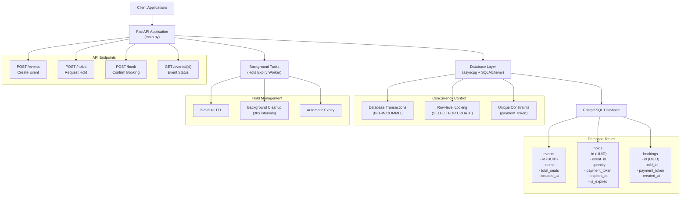

# Ticket Booking System

A high-performance ticket booking system built with FastAPI, PostgreSQL, and Docker Compose. Designed to handle concurrent seat reservations without overbooking, with automatic hold expiry and idempotent booking confirmations.

## Architecture Overview



## API Endpoints

### 1. Create Event
```http
POST /events

{
  "name": "Concert XYZ",
  "total_seats": 1000
}
```

**Response:**
```json
{
  "event_id": "uuid-here",
  "total_seats": 1000,
  "created_at": "2024-01-01T12:00:00Z"
}
```

### 2. Request Hold
```http
POST /holds

{
  "event_id": "uuid-here",
  "qty": 5
}
```

**Response:**
```json
{
  "hold_id": "uuid-here",
  "expires_at": "2024-01-01T12:02:00Z",
  "payment_token": "secure-token-here"
}
```

**Error Cases:**
- `404`: Event not found
- `400`: Not enough seats available

### 3. Confirm Booking
```http
POST /book

{
  "hold_id": "uuid-here",
  "payment_token": "secure-token-here"
}
```

**Response:**
```json
{
  "booking_id": "uuid-here"
}
```

**Error Cases:**
- `404`: Hold not found
- `400`: Invalid payment token
- `400`: Hold expired or already booked

### 4. Event Status
```http
GET /events/{event_id}
```

**Response:**
```json
{
  "total": 1000,
  "available": 950,
  "held": 30,
  "booked": 20
}
```

## Expiry/Worker Design

### Background Worker
- **Cleanup Frequency**: Runs every 30 seconds
- **Async Implementation**: Non-blocking background task
- **Error Handling**: Graceful failure recovery with logging

### Expiry Logic
```sql
UPDATE holds 
SET is_expired = true 
WHERE expires_at <= NOW() 
  AND is_expired = false
```

### Real-time Availability Calculation
```sql
SELECT 
  total_seats - 
  (active_holds + confirmed_bookings) as available
FROM events e
WHERE e.id = ?
```
